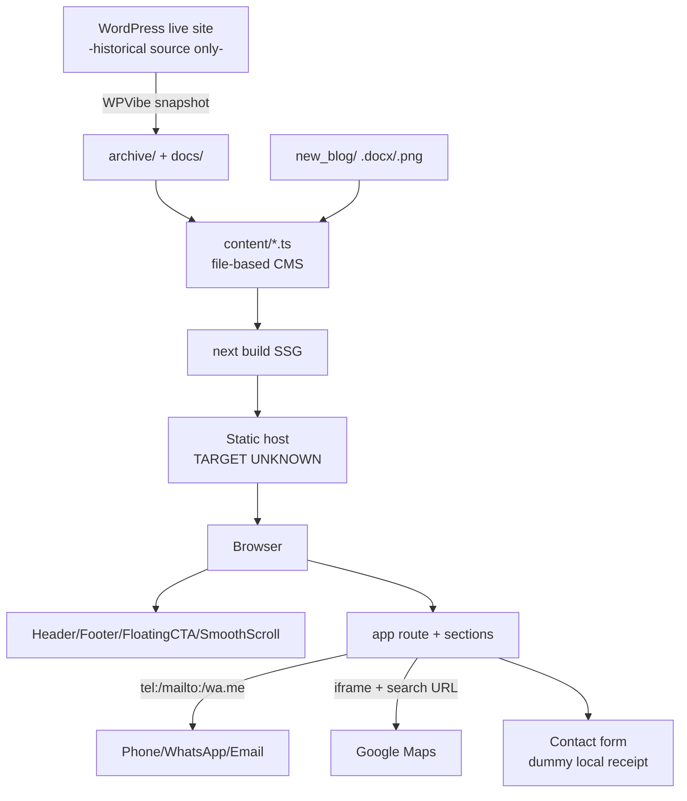
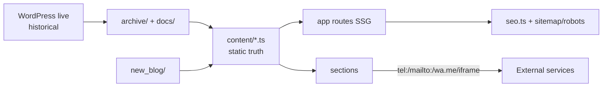

# Mungale Eye Hospital Website — System Documentation

> **Canonical onboarding document.** Read this before touching the code.
> Generated 2026-09-28 from a read-only audit of the repository. No code was modified.
> Evidence convention used throughout: **FACT (code)** = verified in source, **FACT (content)** = verified in content files, **FACT (config)** = verified in config, **INFERRED** = reasonable interpretation, **NEEDS CONFIRMATION** = requires a human.

---

## New Developer Quick Start

**What this is:** a static Next.js 15 marketing + patient-education website for **Mungale Eye Hospital, Vadodara, Gujarat** (live at `https://mungaleeyehospital.com`). It is a rebuild/migration of a WordPress + Elementor site. There is **no backend, no database, no API, no CMS at runtime** — all content lives in TypeScript files under `content/`.

**Read these sections first (5–10 minutes):**

1. [Executive Summary](#executive-summary) — what, who, why
2. [Architecture](#5-architecture) — static SSG, content layer, diagram
3. [Route Map](#6-route-inventory) — every page and its status
4. [Shared Components](#11-component-architecture) — what is reused where
5. [Content Sources & Ownership](#9-content-inventory) — exactly which file to edit for each fact
6. [How to Run / Build](#42-build--deployment)
7. [Do Not Touch This](#40-do-not-touch-this) — fragile areas

**Then go deep (1–3 hours):** page-by-page audit (§7), design system (§14), forms (§16), tech debt (§31), duplicated business logic (§33).

**10 most important things to know:**

1. `content/site.ts` is the closest thing to a source of truth (phones, address, hours, nav, stats) — but address/phones/hours are ALSO hardcoded in Footer, LocationBlock, FAQ explorer. See §33.
2. The contact/booking form **submits nowhere** — it shows a local receipt by owner instruction (`CONTENT_GAPS #3`). Phone (`tel:`) is the real conversion path.
3. Stats `40,000+` / `15,000+` are **unverified website claims** (`CONTENT_GAPS #1`). Only `20+` (years, est. 2007) is verified.
4. Six treatment child pages each have a bespoke component (`components/sections/Treatment*.tsx`) sharing `TreatmentShell` / `TreatmentNavigator` / `Clinical*` / `SafeImage`.
5. Blog = 31 posts as verbatim WordPress HTML stored in `content/blog-bodies.ts` (476 KB), rendered as React text nodes with an index-based link overlay (`content/blog-links.ts`). Fragile — see §40.
6. CTA wording convention is `Book a consultation`; `Book an Appointment` survives only in aria-labels (drift, §32).
7. Colors: cream `#F8F7F3`, ink `#111112`, red `#ED2225` / dark red `#B9191C`. Tokens in `tailwind.config.ts`; shadows/animations in `app/globals.css`.
8. `/dev/palette/` is a publicly routable dev page with no metadata — should be `noindex` or deleted.
9. `public/images/` has duplicate trees (`service-*` vs `services/`, `c1.jpg` + `c1.png`, logo in two folders) and inconsistent WP-mirrored filenames. `SafeImage` hides missing files silently.
10. Deployment target is **unknown** — no vercel/netlify/docker config, README is one line. **NEEDS CONFIRMATION.**

---

## Executive Summary

- **What:** Static, fully pre-rendered Next.js 15 + React 19 + TypeScript + Tailwind CSS v4 website for Mungale Eye Hospital (cornea, glaucoma, cataract, optical care), Vadodara.
- **Who:** New/existing patients, caregivers, referral and insurance (cashless) patients, people researching eye conditions, people needing directions/hours.
- **Business goals:** Drive consultation bookings via phone (`+91 8140050055`) and the contact page; explain treatments in plain language; document cashless-insurance process (HDFC ERGO, IFFCO Tokio, Navi, Tata AIG); build trust (doctors, reviews, gallery, journal).
- **Content areas:** Home, About, Treatment Atlas + 6 treatment detail pages, Insurance & Cashless, Contact/Booking, FAQs, Gallery, Blog journal (31 articles), Privacy stub.
- **Architecture:** 100% static SSG. `content/*.ts` (file-based CMS) → `app/*/page.tsx` + `components/sections/*` → static HTML. Zero API routes, zero database, zero runtime CMS. External touchpoints are outbound links only: `tel:`, `mailto:`, `wa.me`, Google Maps embed/links, Google Fonts at build time.
- **Key technical decisions:** file-based content instead of headless CMS (simplicity, zero backend); verbatim WordPress content preserved with `DRAFT-COPY`/`OWNER-PROVIDED` markers; Lenis smooth scroll instead of framer-motion; `SafeImage` fail-to-null media; index-based link overlay for blog bodies instead of HTML rewriting.

---

## Table of Contents

1. [Repository Map](#1-repository-map)
2. [Application Identity](#2-application-identity)
3. [User Journeys](#3-user-journeys)
4. [Technology Stack](#4-technology-stack)
5. [Architecture](#5-architecture)
6. [Route Inventory](#6-route-inventory)
7. [Page-by-Page Deep Audit](#7-page-by-page-deep-audit)
8. [Thin Content Audit](#8-thin-content-audit)
9. [Content Inventory](#9-content-inventory)
10. [Content Ownership](#10-content-ownership)
11. [Component Architecture](#11-component-architecture)
12. [Shared Component Map](#12-shared-component-map)
13. [Layout System](#13-layout-system)
14. [Design System](#14-design-system)
15. [Data Flow](#15-data-flow)
16. [Forms](#16-forms)
17. [Schema / Database](#17-schema--database)
18. [API Inventory](#18-api-inventory)
19. [External Services](#19-external-services)
20. [Environment Variables](#20-environment-variables)
21. [Image + Asset Inventory](#21-image--asset-inventory)
22. [SEO Audit](#22-seo-audit)
23. [Internal Link Graph](#23-internal-link-graph)
24. [Navigation Architecture](#24-navigation-architecture)
25. [Accessibility Audit](#25-accessibility-audit)
26. [Responsive Architecture](#26-responsive-architecture)
27. [Performance](#27-performance)
28. [Security](#28-security)
29. [Error + Empty States](#29-error--empty-states)
30. [Dead Code + Unused Code](#30-dead-code--unused-code)
31. [Technical Debt](#31-technical-debt)
32. [Design / Implementation Drift](#32-known-designimplementation-drift)
33. [Duplicated Business Logic](#33-duplicated-business-logic)
34. [Content Duplication](#34-content-duplication)
35. [Page Depth + IA](#35-page-depth--information-architecture)
36. [Thin + Overloaded Pages](#36-thin--overloaded-pages)
37. [Page Purpose Matrix](#37-page-purpose-matrix)
38. [Content Gap Audit](#38-content-gap-audit)
39. [Future Developer Onboarding](#39-future-developer-onboarding)
40. [Do Not Touch This](#40-do-not-touch-this)
41. [Change Impact Map](#41-change-impact-map)
42. [Build + Deployment](#42-build--deployment)
43. [Known Limitations](#43-known-limitations)
44. [Final Website Map](#44-final-website-map)

---

## 1. Repository Map

**FACT (code/config).** Top-level tree (pruned: `node_modules/`, `.next/`, build output):

```
/
├── app/                        Next.js App Router — ALL routes (17 files)
│   ├── layout.tsx              Root layout: fonts, Header/Footer/FloatingCTA/SmoothScroll, JSON-LD, metadata
│   ├── page.tsx                Home (/)
│   ├── globals.css             Tailwind v4 entry + brand shadows, reveal, hero animations, link focus
│   ├── sitemap.ts / robots.ts  SEO utility routes
│   ├── not-found.tsx           Styled 404
│   ├── about-us/page.tsx
│   ├── treatments/page.tsx             Treatment Atlas index
│   ├── treatments/[slug]/page.tsx      6 treatment detail pages (switch → Treatment*.tsx)
│   ├── insurance-cashless/page.tsx
│   ├── contact-us/page.tsx
│   ├── faqs/page.tsx
│   ├── gallery/page.tsx
│   ├── blog/page.tsx
│   ├── blog/[slug]/page.tsx            31 articles
│   ├── privacy-policy/page.tsx         Explicit placeholder stub
│   └── dev/palette/page.tsx            Internal design-token preview (INFERRED: should not be public)
├── components/
│   ├── layout/ (5)             Header, Footer, MobileNavDrawer, FloatingCTA, SmoothScroll — on every page
│   ├── sections/ (~28)         Page sections; Treatment* only on treatment children
│   ├── ui/ (9)                 shadcn-style primitives (Button, Tabs, Card, Badge, Input, Container,
│                               SectionHeader, StatChip, motion.tsx = Reveal/CountUp/Parallax)
│   ├── icons/duotone.tsx       Custom duotone icons (used alongside lucide-react)
│   └── seo/JsonLd.tsx          <script type="application/ld+json"> renderer
├── content/ (17 .ts)           FILE-BASED CMS — the content source of truth (see §9–10)
├── lib/utils.ts                cn() only (clsx + tailwind-merge)
├── public/images/              ONLY asset folder: ~216 files (see §21)
├── scripts/process-images.ts   Sharp batch converter (manifest-driven; build-time only)
├── docs/ (9 files)             SITE_INVENTORY, SECTION_MAP, PROGRESS, PHASE_TODOS, PHASE3_PLAN,
│                               PHASE7_PLAN, PALETTE, CONTENT_GAPS, ASSET_MANIFEST.json
├── archive/ (gitignored)       Frozen WordPress migration snapshot (analysis/assets/content/raw) — NOT built
├── new_blog/ (10 files)        5× .docx + 5× .png — source for the 5 newest blog posts
├── package.json / package-lock.json (lockfileVersion 3)
├── next.config.ts / tailwind.config.ts / postcss.config.mjs / tsconfig.json
├── .eslintrc / .prettierrc / components.json (shadcn new-york) / opencode.json
├── design.md (206 lines) / MASTER_PROMPT.md (269) / reference_home.html (Oliva blueprint)
├── README.md — FACT: exactly 1 line (`# drmeetamungale`)
└── Pruned from this audit: node_modules/, .next/, tsconfig.tsbuildinfo, next-env.d.ts

| Folder | Purpose | Important files | Used by |
|---|---|---|---|
| `app/` | All routes (App Router) | `layout.tsx`, `page.tsx`, `globals.css`, `sitemap.ts`, `robots.ts`, `not-found.tsx` | Every page render |
| `components/layout/` | Site chrome, mounted once in `app/layout.tsx:69-73` | `Header.tsx`, `Footer.tsx`, `MobileNavDrawer.tsx`, `FloatingCTA.tsx`, `SmoothScroll.tsx` | All pages |
| `components/sections/` | Page sections | `Hero.tsx`, `Treatment*.tsx` (6), `Clinical*.tsx`, explorers, `SafeImage.tsx` | Their respective pages |
| `components/ui/` | shadcn-style primitives | `Button.tsx`, `motion.tsx` (`Reveal`), `Tabs.tsx` | Mostly `Reveal`; several are definition-only dead code (see §30) |
| `content/` | File-based CMS | `site.ts`, `treatment-*.ts`, `blog/`, `faqs.ts`, `gallery.ts`, `seo.ts` | Pages + sections + sitemap/robots |
| `lib/` | Single helper | `utils.ts` (`cn()`) | ui/sections class merging |
| `public/images/` | All static media | 9 subfolders, ~216 files | `next/image` + `SafeImage` renders |
| `scripts/` | Build-time image pipeline | `process-images.ts` (needs `tsx`, NOT in package.json — NEEDS CONFIRMATION) | `npm run process-images` |
| `docs/` | Migration inventory + plans + gaps | `CONTENT_GAPS.md`, `PROGRESS.md`, `ASSET_MANIFEST.json` | Developers, not runtime |
| `archive/` | Frozen WP snapshot (gitignored) | `analysis/`, `assets/`, `content/`, `raw/` | Nobody at runtime; reference only |
| `new_blog/` | Draft sources for 5 newest posts | 5× `.docx` + 5× `.png` | Already transcribed into `content/blog/` |

## 2. Application Identity

### What Is This Website?

**FACT (code/content/config):**

- **Name/brand:** Mungale Eye Hospital (`content/site.ts:5`, `app/layout.tsx:27-55`).
- **Business/industry:** Private eye hospital — cornea, glaucoma, cataract, optical/contact-lens care.
- **Location:** 2nd Floor, Vinraj Plaza, opp. Government Press, Kothi Road, Anandpura, Vadodara 390001 (`content/site.ts:6`).
- **Primary users:** New patients, existing patients, caregivers/family, referral patients, condition researchers, insurance/cashless patients, direction/hours seekers, health-content readers — all roles are supported by actual pages (see §37).
- **Primary business objective:** Consultation bookings (via phone + contact page).
- **Primary user objectives:** Understand a condition/treatment; verify cashless eligibility + process; find doctors, hours, location; ask pre-visit questions; read eye-health articles.
- **Core conversion:** `tel:+918140050055` call or `/contact-us/` booking request → phone confirmation.
- **Website role:** Marketing + patient-education front door; rebuild of the live WordPress/Elementor site as static Next.js.

### Why This Website Exists

The hospital's live site (`mungaleeyehospital.com`, WP 6.9.9 + Hello Elementor per `docs/SITE_INVENTORY.md`) is being rebuilt as a fast, premium, low-maintenance static site: treatment education, cashless-insurance guidance, doctor trust, and phone/contact conversion — with zero backend to operate.

### Who Uses It?

Only roles with repository support are listed: new/existing patients (`/`, `/treatments/*`, `/contact-us/`), caregivers (`/about-us/`, `/faqs/`), referral patients (`/about-us/`, doctors), condition researchers (`/treatments/`, `/blog/`), insurance patients (`/insurance-cashless/`), direction seekers (`LocationBlock`, `/contact-us/#visit`), health-content consumers (`/blog/`).

## 3. User Journeys

| Journey | Entry | Pages | Primary action | End state | Verdict |
|---|---|---|---|---|---|
| A. New patient → treatment → doctor → appointment | `/` → `CareDiscovery` concern | `/treatments/[slug]/` → `/contact-us/#book` | Submit request / call | Dummy receipt + "call to secure" | Supported; online conversion dead-ends at dummy form — phone is real path |
| B. Condition → detail → appointment | `/treatments/` Atlas or Google | `/treatments/[slug]/` → `/contact-us/` | Book a consultation | Same as A | Fully supported; richest on cornea/glaucoma, thinnest on cataract/optical |
| C. Insurance → process → contact | Header "Insurance & Cashless" | `/insurance-cashless/` → `tel:` desk | Call insurance desk | Phone call | Supported; minor dead-ends: Retina plain text, no handoff link to `/contact-us/` |
| D. Directions | Any page footer / `LocationBlock` | `/contact-us/#visit` | Google Maps link / copy address | External Maps | Fully supported |
| E. Blog → article → treatment → consult | `/blog/` explorer | `/blog/[slug]/` → inline links | Related article / sparse treatment link | Reading; leaky conversion | Supported but leaky: no persistent treatment/booking CTA, generic related (first 3 with covers) |
| F. Unsure need → concern explorer → care | `/` → "Not sure where to start" | `ConversationPanel` | `tel:` / `/contact-us/` | Conversation, not diagnosis | Supported as designed (no symptom checker — explicitly refused) |

**Broken / dead-end / missing:** form backend missing (Journey A/B terminal is dummy); blog articles lack treatment CTA (leak); Retina mention has no page; no visit-process section anywhere (`TODO(content)` in `app/page.tsx:17-19`); `/privacy-policy/` is terminal stub (correct, not broken).

## 4. Technology Stack

**FACT (config + imports).** Installed: Next.js **15.5.26** (`^15.0.0`), React **19.3.0**, TypeScript **5.9.3** (strict, `noUncheckedIndexedAccess`, `target ES2017`, `@/*` paths), Tailwind **4.3.3** (via `@tailwindcss/postcss`), Node types 20.17.6. Lockfile `package-lock.json` v3.

| Dependency | Version | Where used | Why / importance |
|---|---|---|---|
| `next` | ^15.0.0 | All routes, `next/image` (~14 files), `next/navigation`, `next/font/google`, `sitemap.ts`, `robots.ts` | Core framework + SEO routes. Critical |
| `react` / `react-dom` | ^19.0.0 | Every `.tsx` | UI runtime. Critical |
| `lenis` | ^1.3.26 | `components/layout/SmoothScroll.tsx` (`autoRaf`, `lerp:0.1`, `anchors:true`) | Sole animation lib (no framer-motion). Medium |
| `lucide-react` | ^0.500.0 | ~18 files + custom `icons/duotone.tsx` | Icon system. Medium-high |
| `clsx` + `tailwind-merge` | ^2.1.1 / ^3.7.0 | `lib/utils.ts` → `cn()` | Class merging. Medium |
| `class-variance-authority` | ^0.7.1 | `ui/Button.tsx` (`cva`) | Button variants. Low-medium |
| `@radix-ui/react-slot` | ^1.3.3 | `ui/Button.tsx` (`asChild`) | Low |
| `@radix-ui/react-tabs` | ^1.1.21 | `ui/Tabs.tsx`, consumed by explorers (INFERRED) | Tabs UX. Medium |
| `@radix-ui/react-accordion` | ^1.2.20 | Declared but NO direct import found (hand-rolled accordions used) | UNCLEAR — possibly unused. NEEDS CONFIRMATION |
| `sharp` | ^0.34.5 | `scripts/process-images.ts` only (build-time; NOT runtime optimizer) | Image pipeline. Low at runtime |
| Toolchain (dev) | TS/eslint 9 + `@typescript-eslint` 8.70 / prettier 3 / postcss 8.5 | `.eslintrc` (legacy format + eslint 9 — INFERRED: `next lint` may warn) | Toolchain |

**Verified absent** (grep + package.json): framer-motion, react-hook-form/zod, any CMS client, analytics (no gtag/posthog), email (no resend/nodemailer), tests (no jest/vitest/playwright), i18n, Maps SDK. Fonts via `next/font/google` (`Plus_Jakarta_Sans` 400–700, `Fraunces` 500–700 + italic). Images via `next/image` + `SafeImage`; no `images.remotePatterns` in `next.config.ts`.

## 5. Architecture

Plain English: a browser requests a page; Vercel/Node (host TBD) serves **pre-rendered static HTML** (SSG, no server code); the page is composed of a global chrome (Header/Footer/FloatingCTA/SmoothScroll) plus route sections; every word comes from `content/*.ts` at build time; the only "backend" is the visitor's own phone app, email client, WhatsApp, or Google Maps opened via outbound links. The contact form never leaves the browser.



## 6. Route Inventory

**FACT (code).** Discovered from `app/**/page.tsx` + `next.config.ts` + `app/sitemap.ts`.

| Route | Page file | Purpose / audience | Primary CTA | Data source | Depth | Status |
|---|---|---|---|---|---|---|
| `/` | `app/page.tsx` | Trust + concern discovery + doctors + reviews + visit / new patients | Book a consultation → `/contact-us/` | Static + `content/{doctors,reviews,blog,treatments,site}.ts` | Rich | COMPLETE |
| `/about-us/` | `app/about-us/page.tsx` | Story, approach, expertise, doctors teaser / trust-seekers | Book / explore treatments | Static + `content/doctors.ts` | Rich | COMPLETE |
| `/treatments/` | `app/treatments/page.tsx` | Treatment Atlas hub (6 chapters + facilities) / researchers | View treatment → `[slug]` | `content/treatments-atlas.ts` (verbatim) | Rich | COMPLETE |
| `/treatments/cornea-evaluation/` | `app/treatments/[slug]/page.tsx` → `TreatmentCorneaEval.tsx` | 7-instrument diagnostic guide / pre-treatment patients | Book consultation | `treatment-details.ts` + `treatment-pages.ts` | Rich | COMPLETE |
| `/treatments/corneal-treatments/` | → `TreatmentCorneal.tsx` | Keratoconus/infection/transplant/burns/dry-eye/allergy/SJS | Book + emergency call | Same | Rich | COMPLETE |
| `/treatments/glaucoma-evaluation/` | → `TreatmentGlaucomaEval.tsx` | Full work-up tonometry→OCT / suspects | Book consultation | Same (11 sections) | Rich | COMPLETE |
| `/treatments/glaucoma-treatments/` | → `TreatmentGlaucomaTreatments.tsx` | SLT/YAG/surgeries/MIGS/valves/congenital | Book consultation | Same (4 sections) | Medium-rich | COMPLETE |
| `/treatments/cataract-surgery/` | → `TreatmentCataract.tsx` | Phaco platforms + IOL / cataract patients | Book consultation | Same (only 2 sections) | Thin-medium | PARTIAL |
| `/treatments/optical-contact-lenses/` | → `TreatmentOptical.tsx` | Spectacles + specialty lenses / shoppers | Book / visit optical | Same (only 2 sections) | Thin-medium | PARTIAL |
| `/insurance-cashless/` | `app/insurance-cashless/page.tsx` | 4 partners, 4-step process, checklist, FAQ / insured | Call desk `tel:+918140250055` | `content/{insurance,insurance-faqs}.ts` | Rich | COMPLETE |
| `/blog/` | `app/blog/page.tsx` → `JournalExplorer` | 31-article journal + filters / researchers | Read article | `content/blog/` + bodies | Rich | COMPLETE |
| `/blog/[slug]/` ×31 | `app/blog/[slug]/page.tsx` | Verbatim article + links + related / readers | Related article (weak) | `blog-bodies.ts` + `blog-links.ts` | Rich | COMPLETE |
| `/faqs/` | `app/faqs/page.tsx` → `FaqExplorer` | 8 searchable Q&As / pre-visit | Call / Book | `content/faqs.ts` (verbatim) | Rich | COMPLETE |
| `/gallery/` | `app/gallery/page.tsx` → `MasonryGallery` | 22 photos + program history / trust-seekers | None (browse) | `content/gallery.ts` | Medium | COMPLETE |
| `/contact-us/` | `app/contact-us/page.tsx` → `ContactBookingForm` + `LocationBlock` | Booking (dummy), directions, emergency, prep / ready-to-book | Submit / `tel:` / directions | `content/contact.ts` + `site.ts` | Rich | COMPLETE* (*form dummy) |
| `/privacy-policy/` | `app/privacy-policy/page.tsx` | Honest legal stub | → `/contact-us/` | Static | Thin | PLACEHOLDER |
| `/dev/palette/` | `app/dev/palette/page.tsx` | Token swatches / devs only; not in sitemap | None | Hardcoded hex | n/a | UTILITY (INFERRED: add noindex) |
| `/*` | `app/not-found.tsx` | Styled 404 → Home / Call | Home / `tel:` | `content/site.ts` | n/a | UTILITY |
| `/sitemap.xml`, `/robots.txt` | `app/sitemap.ts`, `app/robots.ts` | 9 static + 6 treatments + 31 posts; allow-all | — | `site.ts`, details, blog | n/a | UTILITY |
| `/category/*`, `/tag/*`, `/author/*`, `/page/*` | `next.config.ts` 301 → `/blog/` | WP archive cleanup | — | Config | n/a | UTILITY |

No `/doctors/*`, `/retina/*`, `/terms/*` routes exist. Footer "Doctors" points to `/about-us/` by documented design.

## 7. Page-by-Page Deep Audit

Conventions: every page except `/` renders `Header → breadcrumb → … → Footer + FloatingCTA`. Breadcrumbs add the Treatments level on child pages. All treatment children end with the global red footer closer (sole closer — no white duplicate CTA by design).

### `/` (`app/page.tsx`)

Purpose: convert new patients via trust + concern→care discovery. Sections in order: `Header` (+`MobileNavDrawer`) → `Hero` (CTAs → `/contact-us/`, `/about-us/`) → `TrustPillars` (20+/40k+/15k+ sticky story — stats unverified) → `CareDiscovery` (concerns → treatments/`/contact-us/`/`tel:`) → `DoctorsStory#doctors` (→`/about-us/`) → `Reviews` (6 verbatim; ext Google search) → `HealthInsights` (featured + 3 → `/blog/`) → `LocationBlock#visit` (map + `tel:` + ext directions) → `Footer` + `FloatingCTA` (`tel:`/`wa.me`→`/contact-us/`). Issues: unverified stats; WhatsApp link uses `href="#"` + `preventDefault` (dead without JS); no visit-process section (code TODO).

### `/about-us/` (`app/about-us/page.tsx` → `about.tsx` 7 exports)

`AboutHero` (breadcrumb; →`/contact-us/`, `/treatments/`) → `StoryEra#story` (2007/2011/Today verbatim) → `OurApproach` (Listen/Examine/Explain/Plan — INFERRED editorial) → `ExpertiseIndex` (Cornea/Glaucoma/Cataract → real pages; **Retina → `/treatments/` generic — weak**) → `FacilityPlace` (3 real photos) → `DoctorsTeaser` (`DoctorsExperience compact`; "Meet the doctors" → `/#doctors` cross-page anchor — from About it navigates home, confusing). `ClosingStory` exists but is never rendered (dead code).

### `/treatments/` + `/treatments/[slug]/`

Atlas: `AtlasHero` (→`/contact-us/`, `#atlas`) → `TreatmentAtlas` (navigator + 6 chapters from `treatments-atlas.ts`) → facilities (static; →`/about-us/`) → footer CTA. Chapter summaries are `DRAFT-COPY` needing sign-off.
Children (all 6): `TreatmentShell` breadcrumb → hero (`treatment-pages.ts` + `treatment-details.ts`; CTAs →`/contact-us/`, `/treatments/`) → `TreatmentSelectorBar` + `TreatmentRail` (6 siblings) → story chapters (`ClinicalAccordion`) → `ClinicalGallery` → curated Related → circular PrevNext → appointment CTA. Unknown slugs fall back to a generic `PageHero` + `Card` template; invalid slugs `notFound()`. Issues: cataract/optical thin (2 chapters each); `SafeImage` failover hides missing art silently.

### `/insurance-cashless/`

Breadcrumb → hero (`#cashless-process`, desk `tel:`) → 3-fact strip → partners rail (4 logos) → process timeline → checklist → cashless-vs-you-pay → coverage index (3 linked treatments; Retina plain text) → `InsuranceFaq` (FAQ JSON-LD) → fallback reassurance. All `content/insurance*.ts` verbatim. Issues: desk number differs from site main (documented, user-confusing); no link to `/contact-us/`.

### `/blog/`, `/blog/[slug]/`, `/faqs/`, `/gallery/`, `/contact-us/`, `/privacy-policy/`

- **Blog list:** breadcrumb + hero → `JournalExplorer` (search + 6 topics + 6 concerns + load-more → `post.url`). No reading-beyond CTA. INFERRED risk: "Vision correction/LASIK" concern may return zero.
- **Article:** `PageHero` breadcrumb → cover → verbatim blocks (heading/para/list/table) with overlaid links → Related (first 3 with covers, untargeted). No author/date/byline, no treatment CTA, no prev/next — thinnest conversion point.
- **FAQs:** hero → `FaqExplorer` (search + tabs; desktop explorer / mobile accordion; appointment answer linkified → `/contact-us/#book`, `tel:`) → help strip (`tel:`, →`/contact-us/`). Complete.
- **Gallery:** hero → `MasonryGallery` (INFERRED lightbox) → teaching/events verbatim text list. No CTA; fine as trust page.
- **Contact:** hero (`#book`, `tel:`, ext directions) → action navigator → `#book` form (validation, unchecked consent, dummy receipt) → after-submit steps → emergency → `LocationBlock` → before-visit checklist (→`/insurance-cashless/`, `/faqs/`) → contact strip (`tel:`/`mailto:`/directions). Form stores nothing; success copy honestly says "confirmed by phone."
- **Privacy:** `PageHero` + 1 paragraph → `/contact-us/`. Explicit placeholder — correct, not broken.

## 8. Thin Content Audit

| Route | ~Words | Sections | Unique value | Main problem | Classification + why |
|---|---|---|---|---|---|
| `/privacy-policy/` | ~40 | 2 | Honest placeholder | No policy text | CONTENT MISSING — intentional; needs owner legal text |
| `/treatments/cataract-surgery/` | ~150 | hero + 2 accordions + gallery | Equipment names verbatim | Highest-demand topic, thinnest page | SHOULD EXPAND (procedure/recovery/IOL detail) |
| `/treatments/optical-contact-lenses/` | ~150 | hero + 2 accordions + gallery | Specialty-lens range | No fitting process/pricing/brands | SHOULD EXPAND |
| `/treatments/glaucoma-treatments/` | ~350 | hero + 3–4 accordions | SLT/YAG/MIGS specifics | Drops/medication thin | THIN BUT USEFUL |
| `/gallery/` text | ~100 + photos | hero + masonry + program list | Real photography | Text-thin by design | INTENTIONALLY FUNCTIONAL |
| `/dev/palette/` | ~60 | 1 | Dev reference | Publicly routable | INTENTIONALLY FUNCTIONAL — but add noindex |
| Short `/blog/[slug]/` posts | <400 some | body + related | Verbatim archive | No CTA, generic related | SHOULD EXPAND (treatment CTA, topical related) |
| `/` visit-process | 0 | — | — | "What happens at visit" absent (code TODO) | CONTENT MISSING |

## 9. Content Inventory

**Verdict: 100% static SSG. No runtime CMS, DB, or API.** Zero `fetch`/`wp-json`/`graphql` in `app/`, `components/`, `content/`, `lib/` (only `opencode.json` names a remote WPVibe MCP — dev-tooling only).

| File | Exports | Consumed by | Records (FACT) |
|---|---|---|---|
| `content/site.ts` | `siteConfig` (name, url, address, phones, email, hours, social, doctors/nav/stats) | layout, sitemap/robots, Header/Drawer/Footer/FloatingCTA, LocationBlock, CareDiscovery, Reviews, TreatmentNavigator, insurance/contact pages, `not-found` | 2 doctors, 6 treatments, 3 stats, 5 nav items |
| `content/contact.ts` | Map embed, QR/hero srcs, 5 address lines, phones, 2 doctors, 5 prep items, consent/Sheets strings, success copy, `telOf()` | `app/contact-us/page.tsx`, `ContactBookingForm.tsx` | — |
| `content/doctors.ts` | `doctors[2]`, `getDoctorBySlug()` | `DoctorsStory.tsx`, `seo.ts` physicians JSON-LD | 2 doctors |
| `content/treatments.ts` | `treatments[6]`, getters | Slug fallback, `CareDiscovery`, `RelatedTreatments`, `seo.ts` | 6 cards |
| `content/treatment-details.ts` | `treatmentDetails[6]` verbatim | Slug page, Cataract/Optical sections, via `pageDetails()` | 2/7/7/11/4/2 sections per page |
| `content/treatments-atlas.ts` | `atlasTreatments[6]`, 3 categories, 2 facilities | `/treatments/`, `TreatmentAtlas`, `treatment-pages.ts` | 6 chapters |
| `content/treatment-pages.ts` | `treatmentPages[6]` + `pageGallery()`, `pageDetails()` | All 6 `Treatment*.tsx` | 6 pages |
| `content/insurance.ts` | Desk no., 4 partners, 4 steps, 5 checklist, definition, 4 pay-items, 4 coverage, fallback, address | `/insurance-cashless/` | 4 partners / 4 steps |
| `content/insurance-faqs.ts` | `insuranceFaqs[9]` | Page + `InsuranceFaq` + `faqJsonLd` | 9 FAQs |
| `content/faqs.ts` | `faqs[8]`, 5 categories + map | `/faqs/` + `FaqExplorer` | 8 FAQs |
| `content/gallery.ts` | `galleryPhotos[22]`, `galleryPrograms[9]`, filters | `/gallery/` + `MasonryGallery` | 17 moments + 5 clinical + 9 text programs |
| `content/reviews.ts` | `reviews[6]` | `Reviews.tsx`, `TrustPillars` excerpt | EN 3, GU 2, MR 1 |
| `content/images.ts` | `imageAssets[~110]` | Largely legacy/unused; renders use hardcoded `/images/…` | ~110 rows, many generic |
| `content/blog/index.ts` | `blogPosts[31]` | `/blog/`, slugs, `HealthInsights`, `JournalExplorer`, `seo.ts` | 26 WP + 5 `new_blog/` |
| `content/blog-bodies.ts` | `blogBodies[]` verbatim WP `content.rendered` | Slug page via `getBlogBody()` | 26+ bodies; file 476 KB / 9,794 lines |
| `content/blog-links.ts` | `blogLinks: Record<slug, BlogLink[]>` | Slug page overlay | ~26 slugs × 2–6 links |
| `content/seo.ts` | hospital/physicians/procedure/faq/blogPosting/breadcrumb JSON-LD builders, `canonical()` | layout + all pages | — |

Other sources: static strings in components (many marked `OWNER-PROVIDED`/`DRAFT-COPY`); `new_blog/` 5×`.docx`+5×`.png` (transcribed; posts dated 2026-09-28); `archive/` frozen WP snapshot (not imported); `docs/ASSET_MANIFEST.json` (110 assets, WP `originalUrl`s); hardcoded arrays (`contact-us:124-127`, `Footer:30-37`, `about.tsx` eras/principles/specialties, `TrustPillars:30-67`).



## 10. Content Ownership

Exact file to edit:

| Item | File |
|---|---|
| Address | `content/site.ts:6` (+ copies: `contact.ts:23-29`, `insurance.ts:116-117`, `LocationBlock.tsx:26-27`, `Footer.tsx:123-129`) |
| Phones / emergency / WhatsApp | `content/site.ts:12-16`; desk override `insurance.ts:17-18`; hardcoded FAQ copies `FaqExplorer.tsx:32-43`, `faqs/page.tsx:81` |
| Hours | `content/site.ts:18` (rendered Footer, LocationBlock; live-source conflict `insurance.ts:9-12`) |
| Email / doctors / treatments / atlas / insurance / FAQs / gallery / blog | `site.ts:17` / `doctors.ts:16-35` / `treatments.ts` + `treatment-details.ts` + `treatments-atlas.ts` + `treatment-pages.ts` / `insurance.ts` / `faqs.ts` / `gallery.ts` / `blog/index,bodies,links.ts` |
| Footer copy / SEO / form / colors / type | `Footer.tsx` / per-page `metadata` + `layout.tsx:27-55` + `seo.ts` / `ContactBookingForm.tsx` + `contact.ts:65-73` / `tailwind.config.ts:11-62` + `globals.css` / `layout.tsx:12-25` + `tailwind.config.ts:64-92` |

## 11. Component Architecture

47 component files. **Global** (every page via `app/layout.tsx:69-73`): `Header` (client, `useState` + rAF hide), `Footer` (server + `Reveal`), `FloatingCTA` (client, `window.open`), `SmoothScroll` (Lenis), `MobileNavDrawer` (`isOpen,onClose`, via Header). **Sections:** `Hero`, `TrustPillars`, `CareDiscovery`, `DoctorsStory/DoctorsExperience` (`compact?`), `Reviews`, `HealthInsights`, `LocationBlock`, `PageHero` (`breadcrumb,eyebrow?,title,subtitle?`), `AtlasHero`, `TreatmentAtlas`, `RelatedTreatments`, `ContentSection`, `TreatmentShell` (`current,children`), `TreatmentNavigator/SelectorBar/Rail` (`activeSlug`), `ClinicalAccordion` (`title,body`), `ClinicalGallery`, `ClinicalLightbox` (`images,index,onClose`), `SafeImage`, `ContactBookingForm`, `JournalExplorer`, `FaqExplorer` (`faqs,categories`), `InsuranceFaq`, `MasonryGallery`, `about.tsx` 7 exports, 6 prop-less `Treatment*.tsx`. **Utility:** `Container`, `Button` (`primary/secondary/tonal/ghost/cta` — used once, `Hero.tsx:139`), `Badge`, `Card`, `Input/Select`, `Tabs`, `StatChip`, `SectionHeader`, `motion.tsx` (`Reveal` 26 refs; `CountUp`/`Parallax` unused), `JsonLd` (10 refs), `duotone.tsx` (~25 icons, only `GoogleBadge` traced to `Reviews.tsx:122`).

## 12. Shared Component Map

Columns: Home | About | Atlas | Child | Insurance | Contact | FAQ | Gallery | Blog(list/slug).

| Component | Ho | Ab | At | Ch | In | Co | FA | Ga | Bl |
|---|---|---|---|---|---|---|---|---|---|
| Header/Footer/FloatingCTA/SmoothScroll | YES | YES | YES | YES | YES | YES | YES | YES | YES |
| PageHero | NO | NO (`AboutHero` variant) | NO (`AtlasHero`) | VARIANT (fallback only) | NO (inline) | NO (inline) | NO (inline) | NO (inline) | NO / YES (slug) |
| LocationBlock | YES | NO | NO | NO | NO | YES | NO | NO | NO |
| TrustPillars/Reviews/HealthInsights/CareDiscovery | YES | NO | NO | NO | NO | NO | NO | NO | NO |
| DoctorsStory | YES | VARIANT (`compact`) | NO | NO | NO | NO | NO | NO | NO |
| TreatmentShell/Navigator/Clinical*/SafeImage | NO | NO | NO | YES all 6 | NO | NO | NO | PARTIAL (lightbox) | NO |
| ContactBookingForm | NO | NO | NO | NO | NO | YES | NO | NO | NO |
| JournalExplorer | NO | NO | NO | NO | NO | NO | NO | NO | YES / NO |
| FaqExplorer / InsuranceFaq / MasonryGallery / TreatmentAtlas | NO | NO | Atlas YES | NO | InsuranceFaq YES | NO | FaqExplorer YES | Masonry YES | NO |
| about.tsx blocks | NO | YES (minus `ClosingStory`) | NO | NO | NO | NO | NO | NO | NO |

Reading: chrome is truly global; heroes are per-page bespoke (3 implementations + inline variants); the treatment system is fully shared across children; explorers are one-page-only.

## 13. Layout System

- **Root** `app/layout.tsx:57-76`: `Header → main#content → Footer → FloatingCTA → SmoothScroll` + skip-link, `JsonLd`, `font-sans bg-background min-h-screen flex flex-col overflow-x-clip`.
- **Header** (`Header.tsx:100-234`): `fixed top-0 z-50`, floating `max-w-6xl rounded-[20px] h-19 bg-background/70 backdrop-blur-xl`; auto-hide past 160px, reappear on scroll-up; hover/focus dropdowns (`rounded-2xl w-64`); spacer `h-25 lg:h-28` preserves flow; CTA filters out `/contact-us/`.
- **Footer** (`Footer.tsx:41-317`): red `bg-primary py-16 lg:py-20` (`See life clearly.` 48/64/80px) → charcoal `bg-secondary` 12-col grid (5/3/4) + legal bar + `MUNGALE` watermark (110/140/170px, negative margins).
- **FloatingCTA**: `fixed bottom-4 right-4 sm:bottom-6 sm:right-6 z-40` + safe-area, `bg-white/90 rounded-full`, 3× `w-9 h-9` circles.
- **Containers:** overwhelmingly `max-w-7xl mx-auto px-6 lg:px-12`; exceptions: Header `max-w-6xl`, prose `max-w-3xl`, `max-w-2xl` supports, map card `max-w-62/72`.
- **Spacing:** home showpieces `py-24 lg:py-32`; about `py-20 lg:py-24/28`; insurance/contact/atlas `py-14 lg:py-20`; `LocationBlock` tight `py-12 lg:py-14`; hero paddings differ per hero (3 systems).
- **Breakpoints:** `sm` + `lg` everywhere; `md` once (`treatments/page.tsx:59`); `xl` only in `Hero` + `TrustPillars`; no `2xl`. No custom screens. Sticky offsets vary (`top-24/26/32`, `top-23`, `scroll-mt-28/32`, `scroll-padding-top:120px`).
- **Hardcoded hacks:** `h-19/h-12.5/h-13/w-2.25`, `rounded-[11/13/14/16/20px]`, `top-23`, negatives, `object-[65%_28%]` (`Hero:179`).

## 14. Design System

- **Colors** (truth: `tailwind.config.ts:8-62`): `primary #ED2225`, `primary-fixed #B9191C`, `primary-container #F9EAEA`, `secondary #111112`, `background/surface #F8F7F3`, `warm/tint #F1EFEA`, borders `#DDDAD3`, grey text `#6E7072`, `star-gold #F59E0B`, `success-emerald #10B981`. Outside config: `globals.css` brand shadows + `rgba(237,34,37,…)` selection/nav/glow; `duotone.tsx:8` `RED #CE0200` (≠ brand); footer `#ff8080` + watermark `#242424`; `dev/palette` stale `#CCFBF1`.
- **Type:** `Plus Jakarta Sans` 400–700 (`--font-sans`), `Fraunces` 500–700 + italic (`--font-display`) via `next/font`. Scale tokens `label-sm→display-hero` exist but arbitrary overrides dominate (H1s in 4 systems: 54/66/78/88 home; 38/46/56 PageHero; 38/48/56 Atlas; 48/64/80 footer).
- **Buttons:** `Button.tsx` variants all `rounded-full px-6 py-3` — but pages hand-roll rectangular CTAs (`rounded-[13px] h-12`, `rounded-[11px]`, header `rounded-[14px] h-11` + arrow chip, `rounded-full` contact/insurance). Two hierarchies coexist.
- **Radii/borders/shadows:** images `rounded-[20px]` dominant; overlap 16px; thumbs 12px; masonry 10px; pills full. Borders almost always `ring-1 ring-secondary/10`. Shadows `shadow-brand-sm/md`, red glow on `cta` hover only.
- **Motion:** Lenis `{autoRaf, lerp:0.1, anchors:true}`; `Reveal` 0.55s fade+24px; hero rise/fade/sharpen keyframes; elsewhere `duration-200`; reduced-motion handled.
- **Icons:** lucide (`ArrowRight/UpRight, Menu/X, Phone, MessageCircle, CalendarDays, Star, ChevronRight`) + custom duotone (only `GoogleBadge` proven used).

## 15. Data Flow

- **Booking form:** UI (`ContactBookingForm.tsx`) → `onSubmit` validation → `setSent(true)` → local receipt. No handler/API/service/DB/result — terminal in browser.
- **Blog:** `blog/index.ts` + `blog-bodies.ts` → SSG render + `blog-links.ts` overlay → static HTML. Filters/search are in-memory `useState`.
- **Gallery/treatments/doctors/insurance/FAQ:** content `.ts` → SSG → static HTML; filters client-side only.
- **Reviews:** static verbatim; no fetch, no aggregate rating (deliberate).
- **Maps:** iframe + outbound search URLs; no SDK calls. **Error handling:** none (blank iframe if blocked).
- **Error handling overall:** form = inline `role=alert` + focus-first-error; images = fail-to-null; searches = empty-state copy. No network-error paths exist (nothing is fetched).

## 16. Forms

The only form: `ContactBookingForm.tsx` on `/contact-us/#book`. Fields: `name*` (≥2 chars), `mobile*` (Indian `/^[6-9]\d{9}$/`, +91 UI), `email` optional, `doctor*` (Meeta first / Sachin / no-preference), `age` optional (1–120, unvalidated), `message` optional, `consent` checkbox **unchecked, not required**. Validation client-only (`:52-72`), `noValidate`, inline errors + focus-first-error. **Destination: nowhere** — dummy submit by owner instruction (`:19-20`, `CONTENT_GAPS #3`); Sheets disclosure text shown but no integration. Success = local receipt + "confirmed by phone — please also call". **Spam protection: none** (no CAPTCHA/honeypot/rate-limit; zero surface while dummy). Mobile UX: native inputs, stacked, full-width. FAQ/blog/gallery "inputs" are local filters, not forms.

## 17. Schema / Database

**NONE — FACT.** No `*.prisma`, drizzle, migrations, `.env*`, or supabase/mongoose/neon references; no `route.ts`/`actions.ts`/`schema.prisma` anywhere. Content that should theoretically be data (doctors, 6 treatments × 4 layers, 31 posts, 22 gallery rows, 17 FAQs, 4 insurers, reviews, hours/phones) is hardcoded TS. INFERRED: fine at this scale; future booking persistence needs a real store + consent audit. No orphan records / unused fields to report (no schema exists).

## 18. API Inventory

**NO API ROUTES FOUND — FACT.** No `app/api/**`, no `route.ts`, no server actions, no `fetch`/`axios`/`useSWR` in `app/`, `components/`, `content/`, `lib/`. Closest backend-adjacent code: `generateStaticParams`/`generateMetadata` (SSG), `sitemap.ts`/`robots.ts`, pure render helpers `decodeEntities`/`renderRich` (`blog/[slug]:20-86`). No methods, inputs, auth, or side effects to table.

## 19. External Services

| Service | Purpose / location | Credential | Data sent/received | Failure mode |
|---|---|---|---|---|
| Google Maps embed + directions | `contact.ts:16-17,31-36`, `LocationBlock`, `Footer:22`, `insurance.ts:119-124` | None (public URLs, coords `22.304108,73.193533`) | Coords in URL; tiles to client | Blank iframe if blocked; no fallback |
| WhatsApp deep link | `FloatingCTA:42` (`wa.me/<digits>`), `site.ts:16` | None | Digits in URL | Dead tab without WhatsApp |
| Google Fonts (build-time) | `layout.tsx:12-25` | None | Build fetch; runtime self-hosted | Offline build → font fail |
| Social (FB/IG/YT) | `site.ts:19-23` → Footer | None | Outbound click | Handle change → 404 |
| Authority outbound links | `blog-links.ts` (NEI/AAO/Mayo/Cleveland/…) | None | Outbound click | Link rot; legacy `/eye-care/*` intentionally unlinked |
| Google Reviews search | `Footer:23-24` | None | Query string | No aggregate shown (deliberate) |
| Clipboard API | Copy-address buttons | None | Address string | Textarea fallback on denial |
| WordPress origins | `ASSET_MANIFEST.json`, WPVibe MCP (dev only) | None in code | None at runtime (all local) | Stale local copies if WP updates |
| Analytics / email / CDN / Unsplash | **None — FACT** (zero grep hits) | — | — | INFERRED: no telemetry, no email delivery |

## 20. Environment Variables

**FACT: zero `process.env.*` usages; no `.env.example`, no `.env*` files** (`.gitignore` ignores `.env*`). No `NEXT_PUBLIC_*`, no hardcoded secrets (grep `apiKey|SECRET|PASSWORD|TOKEN` clean). Phones/emails/coords in code are public business info, not secrets. Table omitted — there are no variables. INFERRED: nothing to configure to run or deploy.

## 21. Image + Asset Inventory

**FACT:** `public/` contains only `images/` — **216 files**. Root ~105 WP-mirrored `.webp` + team JPG; `blog-covers/` 31 + `urls.txt`; `gallery/` 23; `treatments/` ~40 (`c1..c7, ct1/2, de1-6, g1-7, gt1/2, op1/2, q1, sjs1-3, cb1/2, allergy, infection…` + `c1.png` AND `c1.jpg`); `services/` 6; `hero/` 3; `doctors/` 2 (Meeta 6.7 KB, Sachin 88 KB); `insurance/` 5; `contact/` 1 (location QR, not a photo); `general/` **empty**. Only 4 files exceed 500 KB (2 blog covers ~740 KB, 1 gallery 551 KB, `allergy.jpg` 663 KB).

Key assets: header/drawer logo + favicon `/images/hero/httpsmungaleeyehospital-logo.svg` (**name missing hyphen — hardcoded in 3 files**); OG/apple logo `cropped-logo-2.png`; home hero `IMG_21301-jpg.webp` (`priority+fill`); doctor avatars; contact team photo `welcome-img-1146-1024x768.jpg` (157 KB); QR JPEG; Maps has no local asset.

Problems: **inconsistent WP-mirrored naming** (mixed case, `What-is-the-…-jpg.webp`, numeric `1-1-jpg…34-jpg`, `i1-png.webp`); **duplicates** (Sachin ×3 locations, `eye-care.jpg` ×2, logo ×2 folders, `service-cataract.webp` vs `services/…`, `c1.jpg/png`); `content/images.ts` ~110 rows likely orphaned (`getImageById` no callers); missing files vanish silently via `SafeImage` null + gallery `markFailed` (**masks gaps**); `facility-photo` omitted with no substitute; `general/` dead weight.

## 22. SEO Audit

Root (`layout.tsx:27-55`): title `"Mungale Eye Hospital — Best Eye Hospital in Kothi, Vadodara"` + `"%s | Mungale…"` template, tagline description, `metadataBase`, OG website/`en_IN` + 300×300 logo. **No `twitter:` block, no per-page OG images.** `robots.ts` allow-all + sitemap ref; `sitemap.ts` 9 static + 6 treatments + 31 posts with trailing-slash canonicals; WP archives 301 → `/blog/`.

| Route | Title | Description | H1 (single, verified) | Schema | Indexability |
|---|---|---|---|---|---|
| `/` | Default (layout) | Tagline only — thin | `Hero:61` "You are *seen* here." | `MedicalClinic` | index |
| `/about-us/` | `About Us` + desc | Yes | `about.tsx:58` | `Physician`×2 + `Breadcrumb` | index, canonical |
| `/treatments/` | `Treatments` + desc | Yes | `AtlasHero:32` | `Breadcrumb` + `ItemList` | index, canonical |
| `/treatments/[slug]` | `detail.title` / intro | Yes | One per `Treatment*` | `MedicalProcedure` + `Breadcrumb` | index, canonical; fallback title if slug miss |
| `/blog/` | `Blog` + desc ("Search 26 articles" — **stale vs 31**) | Yes | `blog/page:43` | `Breadcrumb` only | index, canonical |
| `/blog/[slug]` | `post.title` / **desc = title (duplicate)** | Weak | PageHero H1 + body h2/li/p | `BlogPosting` (**no date/author**) + `Breadcrumb` | index, canonical |
| `/faqs/` | `FAQs` + desc | Yes | `faqs/page:45` | `FAQPage` + `Breadcrumb` | index, canonical |
| `/insurance-cashless/` | `Insurance & Cashless` + desc | Yes | `page:61` | `FAQPage` + `Breadcrumb` | index, canonical |
| `/gallery/` | `Gallery` + desc | Yes | `gallery/page:44` | `Breadcrumb` only | index, canonical |
| `/contact-us/` | `Contact Us` + desc | Yes | `contact-us/page:54` | `Breadcrumb` only | index, canonical |
| `/privacy-policy/` | `Privacy Policy` + desc, **no canonical** | Yes | INFERRED single | None | index |
| `/dev/palette` | None | No | `dev/palette:19` | None | **Indexable dev route — HIGH** |
| 404 | — | — | `not-found:15` | None | noindex (Next default) |

## 23. Internal Link Graph

**Hubs:** Header (all primaries), `TreatmentAtlas` + SelectorBar/Rail (full 6-way mesh), insurance coverage index (→3 treatments), `CareDiscovery` (concern→treatments), footer Explore. **Orphans/buried:** `/dev/palette/` (no inbound, not in sitemap — orphan, fine); `/privacy-policy/` (footer legal only — appropriately deep); `/gallery/` (Resources dropdown only — 2 clicks, acceptable); blog posts (via explorer/inline links — deep by nature). **Verified:** no local `href="/…"` 404s — all targets exist. Weak (not broken): About `/#doctors`/`/#visit` (leave About page), Doctors→`/about-us/` (compromise), Retina unlinked (intentional), legacy blog URLs plain text (intentional). **Excessive:** treatment details carry ~13+ treatment links (rail 6 + related 3 + prev/next 2 + CTAs) — justified hub pattern.

```mermaid
flowchart TD
  HOME[/] --> ABOUT[/about-us/]
  HOME --> ATLAS[/treatments/]
  HOME --> INS[/insurance-cashless/]
  HOME --> BLOG[/blog/]
  HOME --> FAQ[/faqs/]
  HOME --> GAL[/gallery/]
  HOME --> CON[/contact-us/]
  HOME --> PRIV[/privacy-policy/]
  ATLAS --> C1[/treatments/cornea-evaluation/]
  ATLAS --> C2[/treatments/corneal-treatments/]
  ATLAS --> C3[/treatments/glaucoma-evaluation/]
  ATLAS --> C4[/treatments/glaucoma-treatments/]
  ATLAS --> C5[/treatments/cataract-surgery/]
  ATLAS --> C6[/treatments/optical-contact-lenses/]
  C1 <--> C2 & C3 & C4 & C5 & C6
  BLOG --> P31[/blog/slug ×31]
  INS --> C2 & C4 & C5
  ABOUT --> ATLAS & C2 & C4 & C5
  CON --> INS & FAQ
```

## 24. Navigation Architecture

**Header** (`site.ts` navTree + separate CTA): `About Us→/about-us/` | `Treatments→/treatments/` ▾ 6 children | `Insurance & Cashless→/insurance-cashless/` | `Resources→#` ▾ Blog/FAQs/Gallery | **[Book a Consultation]→`/contact-us/`** (header + drawer + `FloatingCTA` calendar). Drawer mirrors tree + address/phone/hours. **Footer:** brand + address + `Get directions` (ext) | Explore (About, Doctors→`/about-us/`, Treatments, Patient Stories→ext Google, Health Insights→`/blog/`, Contact, First visit?→`/faqs/`) | Contact (phones, landline, email, hours, 2 emergency nos., IG/FB/YT) | legal bar (© + Privacy). **Breadcrumbs** on every page but `/`; treatments add level. **Prev/next** only on treatment details (circular) + Reviews arrows + blog load-more; no blog prev/next.

Real IA: `/` → About (→ expertise → treatments) / Atlas (→ 6 children, meshed) / Insurance (→ 3 treatments) / Resources (Blog → 31 posts; FAQs; Gallery) / Contact (terminal) / Privacy (terminal stub).

## 25. Accessibility Audit

- **HIGH:** `JournalExplorer:62,106` `alt=""` on informative covers (SR loses article context).
- **HIGH:** WhatsApp `<a href="#">` + `preventDefault` + `window.open` (`FloatingCTA:37-42`) — broken link semantics, no-JS fail.
- **MEDIUM:** reusable `Input/Select` `<label>` without `htmlFor`/`id` (`ui/Input:11,27`) — latent wherever reused (contact form itself is correct: `htmlFor` + `aria-invalid` + `role=alert` + focus-first-error).
- **MEDIUM:** header dropdowns hover/focus-open but no Esc/arrows, `aria-expanded` on parent only; drawer has Esc + initial focus but no trap/return-focus (INFERRED).
- **MEDIUM:** nav underline hover/active only, no `:focus-visible`; gallery alts 17× identical "Hospital photograph…" + `images.ts` placeholder alts ("Image: i1…") — present but meaningless.
- **LOW:** FAQ answer `h3` with no parent `h2`; desktop list `aria-pressed` not `tablist`.
- **RISK (needs axe/Lighthouse, not fact):** red-on-cream, `#B9191C` small caps, `#6E7072` body, white-on-red CTA, `white/80` on lightbox.
- **Positives (FACT):** skip-link, `aria-live` result counts, lightbox `role=dialog aria-modal` + Esc/arrows/swipe, accordions native `<button aria-expanded>`, filters `<button aria-pressed>`.

## 26. Responsive Architecture

Default Tailwind screens only (no custom). Pattern: `grid lg:grid-cols-12 → stack`, `px-6 lg:px-12`, type ramps (`38→48→56`, home `54→66→78→88`). Mobile: burger + full-screen drawer; FloatingCTA safe-area; FAQ desktop 35/65 grid vs mobile accordion; masonry `columns-2 md:3 xl:4`; concern grids `sm:2`. Overflow contained (`body overflow-x-clip`, heroes `overflow-hidden`, tables `overflow-x-auto` + `min-w-140`, drawer/lightbox body lock). Hidden-on-mobile is decorative only (labels, rails, rules) — no functional loss INFERRED. INFERRED risk: anchor clearance depends on header-spacer/`scroll-padding-top:120px` staying in sync; header auto-hide can surprise sticky rails.

## 27. Performance

Code evidence only (no metrics claimed): `next/image` dominant (15+ files); plain `` only for logos ×3 and lightbox runtime (justified in comment). Hero `priority+fill+sizes`; covers featured-`priority` + rest `lazy`; masonry first-4 eager; `SafeImage` lazy by default. **No `blurDataURL` wired** despite generated placeholders (dead pipeline). Fonts self-hosted via `next/font` + `display:swap`. Pages server-rendered; interactivity islanded (`use client`); filters in-memory, no fetch waterfalls. Deps lean (next 15, react 19, lenis, lucide, radix ×3, sharp-build-only, clsx/cva/merge). `blog-bodies.ts` (476 KB) ships per-post render path server-side; journal caps DOM (`PAGE_SIZE=7`). INFERRED: Lenis cost small; `scroll-behavior:smooth` CSS + Lenis anchors may double-smooth (LOW).

## 28. Security

- `dangerouslySetInnerHTML`: **1 occurrence** — `JsonLd.tsx:10` (`JSON.stringify(data)` of trusted `seo.ts` builders, no user input). LOW.
- **No secrets/env** (grep clean); phones/emails are public business data.
- Form validation client-only + bypassable, but submit is dummy — no server to attack. `age/message/consent` unvalidated.
- **Blog HTML safe by construction:** `decodeEntities` then React text nodes (`renderRich :42-86`) — never injected as HTML.
- No open redirects; `encodeURIComponent` on Maps URLs; ext links `target=_blank rel=noopener`; WhatsApp digits sanitized. No exploit attempted.

## 29. Error + Empty States

| Area | State (FACT) | Missing |
|---|---|---|
| Blog search | "No results found." + contact CTA; `aria-live` count | Good |
| FAQ search | "No matching question…" + CTA; live count | Good |
| Gallery filters | "No photographs here right now." plain | Reset button / CTA — LOW |
| Form | Inline `role=alert` + focus-first-error; honest success receipt | No loading (instant, ok); no network path (dummy) |
| Images | `SafeImage` null; gallery `markFailed` removes | Skeleton/placeholder; silent holes |
| 404 | Styled + Home + `tel:` | Search/sitemap links — LOW |
| Loading | `priority/eager` first paint | No `Suspense`/skeleton; load-more no spinner — LOW |

## 30. Dead Code + Unused Code

Definition-only (0 `app/` imports): `SectionHeader`, `Container` (pages inline `max-w-7xl`), `Tabs`, `StatChip`, `Badge`, `CountUp`/`Parallax`, `ClosingStory` (`about.tsx:431`). `Input/Select` form-local only (ok). Duplicate systems: `TreatmentAtlas` local DetailItem/Gallery/Lightbox vs extracted `Clinical*` (Atlas never migrated); `TreatmentShell` vs `PageHero` breadcrumbs; 3 heroes (`Atlas`/`Page`/`About`); `Button` vs hand-rolled CTAs. Remnants: `archive/`, `reference_home.html`, `design.md`, `MASTER_PROMPT.md`, `new_blog/`, `process-images.ts`, `/dev/palette`, stale `#CCFBF1`; ~24 duotone icons with only `GoogleBadge` traced; slug-fallback `Card+ContentSection` template shadowed for all known slugs (near-dead). No action taken (read-only).

## 31. Technical Debt

| Problem | File | Why it matters | Severity |
|---|---|---|---|
| WhatsApp `href="#"` + `window.open` | `FloatingCTA:37-42` | Semantics/SEO/no-JS fail | HIGH |
| `alt=""` on informative covers | `JournalExplorer:62,106` | SR context loss | HIGH |
| Indexable dev route, no metadata | `dev/palette/page.tsx` | Internal tool in search | HIGH |
| Unassociated reusable labels | `ui/Input:11,27` | SR/click-target fail | HIGH (latent) |
| Blog desc = title | `blog/[slug]:95-96` | Duplicate SERP snippets | MEDIUM |
| `BlogPosting` sans date/author; "26 articles" vs 31 | `seo.ts:79-90`, `blog/page:11` | Rich results + stale copy | MEDIUM |
| Dropdowns hover-only; drawer no trap | `Header:139-192`, `MobileNavDrawer:19-38` | Keyboard parity | MEDIUM |
| Parallel image trees + empty `general/` | `public/images/` | Bloat, wrong-file risk | MEDIUM |
| `images.ts` ~110 placeholder rows, likely orphaned | `content/images.ts` | Confusion / name-dep risk | MEDIUM |
| 4-layer treatment rewrite drift risk | `treatments*.ts`, `treatment-pages.ts` | Medical inconsistency | MEDIUM |
| Index-based FAQ/blog-link formatting | `FaqExplorer`, `blog/[slug]:42-86` | Reorder/edit fragility | MEDIUM |
| No `twitter:` meta; privacy sans canonical | `layout:34-49`, `privacy-policy:6-8` | CTR / hygiene | LOW |
| Double smooth-scroll | `globals.css:4-6`, `SmoothScroll` | Jank (unproven) | LOW |
| Unused blur pipeline | `process-images.ts:52`, `images.ts:7` | Dead code | LOW |

## 32. Known Design/Implementation Drift

(1) CTA radius 5-way: 13px hero/about/drawer vs 11px location/footer-red vs 14px header vs full contact/insurance vs icon-circles. (2) Copy `Book a consultation` everywhere vs `Book an Appointment` in aria-labels (`Header:212`, `FloatingCTA:50` — same node says both). (3) Eyebrow red `primary-fixed` vs `#ff8080`-on-dark vs `on-surface/70` home hero. (4) H1s in 4 scale systems. (5) `duotone RED #CE0200` ≠ `#ED2225`. (6) `Button` (`rounded-full`) vs hand-rolled rectangular CTAs. (7) 4 hero patterns (editorial split / text-only / collage / 80vh grid) + 6 bespoke child heroes. (8) Cards: ruled rows vs fallback boxes vs editorial images vs 12px insurance thumbs vs 10px masonry. (9) Closer consistent (single red band) — but contact/insurance inline trios use `→/↗` glyphs vs lucide elsewhere.

## 33. Duplicated Business Logic

| Information | Copies | Locations | Truth (INFERRED) | Risk |
|---|---|---|---|---|
| Main phone `8140050055` | ~10 | `site.ts:12`, `contact.ts:43`, Footer, FloatingCTA, Header via config, LocationBlock, contact-us, faqs | `site.ts` | Low but drift-prone |
| Emergency `8140250055` / `9723311209` | ~8 | `site.ts:14-15`, `contact.ts:45`, `insurance.ts:17`, FaqExplorer, faqs.ts, contact-us, Footer | `site.ts` (+insurance desk own) | **Medium — FAQ prints desk no. as booking no.** |
| Address variants | ~6 | `site.ts:6`, `contact.ts`, `insurance.ts`, `seo.ts`, Footer, LocationBlock | `site.ts` | Low (`opp.`/`Opp.`/`Govt Press` drift) |
| Hours 09–20 / Sun closed | ~5 | `site.ts:18`, `seo.ts`, Footer, LocationBlock, faqs.ts | `site.ts` — but live insurance said 9–7 | **Medium — desk-hours ambiguity** |
| Email | ~4 | Via `site.ts:17` → contact.ts, Footer, contact-us | `site.ts` | Low |
| Doctors (order differs) | ~6 | `site.ts`, `doctors.ts`, `contact.ts`, Hero, about, seo.ts | `doctors.ts` | Low (Meeta-first in contact intentional) |
| Stats `20+ / 40,000+ / 15,000+` | ~4 | `site.ts:36-43`, TrustPillars, Hero comment, about-us | Only `20+` verified | **High — unverified marketing claims** |
| `Book a consultation` | 15+ | Header/Footer/Hero/all Treatment*/about/contact/faqs/FloatingCTA | Convention, no constant | Low (consistent) |

## 34. Content Duplication

Treatment facts rewritten ×4 layers (card → verbatim detail → atlas summary → page intro); atlas/page summaries are `DRAFT-COPY` — medical drift risk. Checklist duplicated word-for-word (`contact.ts:56-62` ≡ `insurance.ts:83-89`) — intentional, stored twice. Insurance fallback ≡ FAQ Q9 answer — intentional single-message, duplicated storage. Address/hours/phones rendered 3× (Footer/LocationBlock/contact strip) — intentional layouts, 3-file edits. Reviews excerpt (`reviews.ts` → `TrustPillars:48-50`) — intentional, wording preserved.

## 35. Page Depth + Information Architecture

Clicks from home: primaries 1 (header/drawer/footer); 6 treatment children 2 (via Atlas/nav/related); 31 posts 2 (via journal); privacy 2 (legal bar); palette ∞ (orphan). Inbound: treatment mesh dense; insurance→3 treatments; About expertise→3 treatments + Atlas; journal→posts; FAQ/contact→phone. Buried-but-appropriate: privacy, gallery (2 clicks), posts. No important page is undiscoverable; no buried conversion content beyond blog CTA leak (§7).

## 36. Thin + Overloaded Pages

- **THIN:** privacy stub (intentional), cataract/optical (expand), short posts (expand CTA/related), gallery text (intentional), visit-process (missing).
- **OVERLOADED:** `/treatments/glaucoma-treatments/` (4 dense accordions — borderline, keep); `/contact-us/` (form + emergency + map + prep + strip — justified terminal, keep); home (10 sections — each serves distinct intent, keep).
- **DUPLICATE:** none requiring merge; 4-layer treatment rewrites are layering, not page duplication.
- **MERGE candidates:** none recommended. **SPLIT candidates:** none — thinnest pages need expansion, not splits.

## 37. Page Purpose Matrix

| Page | Business purpose | User purpose | Primary conversion | Supporting | Unique value | Overlap |
|---|---|---|---|---|---|---|
| `/` | Convert + orient | Trust + find care path | Book/call | Directions, reading | Only concern explorer | None |
| `/about-us/` | Trust | Verify credibility/doctors | Book | Explore treatments | Story, approach, facility | DoctorsStory w/ home (variant, intentional) |
| `/treatments/` | Route researchers | Compare options | View child page | Book | Only full 6-way map | None |
| 6 children | Educate + convert per condition | Understand condition/care | Book/call | Sibling discovery | Verbatim clinical detail | 4-layer rewrites (§34), not page overlap |
| `/insurance-cashless/` | De-risk cost fear | Eligibility + process | Call desk | Treatment links | Only cashless content | Checklist ≡ contact prep (intentional) |
| `/blog/` + posts | SEO + education | Research symptoms/care | (leak — read) | Sparse treatment links | Only long-form archive | None |
| `/faqs/` | Deflect calls | Pre-visit answers | Call/book | — | Only Q&A (+FAQ schema) | Q9 ≡ insurance fallback (intentional) |
| `/gallery/` | Trust | See facility/people | None (browse) | — | Only photography | None |
| `/contact-us/` | Capture intent | Book / directions / emergency | Submit + call | Insurance/FAQ links | Only booking + map + prep | None |
| `/privacy-policy/` | Legal hygiene | Reassurance | Contact | — | Unclear until text supplied | Flagged unclear |

## 38. Content Gap Audit

Supported-by-code gaps only: no first-visit/appointment-expectations page (removed; FAQ substitutes); no pricing/fee info; no Retina page; no emergency-triage guidance (phones only); no doctor profile pages; no reviews page (ext search); privacy stub + no Terms + unchecked consent = weak consent story once form goes live. Plus `CONTENT_GAPS.md`: unverified counters, dummy backend, brand purge, low-res images, missing WP dates, `DRAFT-COPY` sign-offs, Meeta portrait 285×331, hours conflict. No medical requirements invented.

## 39. Future Developer Onboarding

How to work on this website (actual paths):

- Add a page → `app/<route>/page.tsx` (+ `metadata`); add to `Header` nav via `content/site.ts` navTree + `sitemap.ts` if indexable.
- Edit header/footer → `components/layout/Header.tsx` / `Footer.tsx` (nav labels from `content/site.ts:44-61`).
- Edit doctors → `content/doctors.ts` (card order in `site.ts:24-27`, hero credit `Hero.tsx:119-130`).
- Edit treatments → card `treatments.ts`, verbatim `treatment-details.ts`, atlas `treatments-atlas.ts`, composition `treatment-pages.ts`; child layout in `Treatment*.tsx`.
- Edit phone/address/hours → `content/site.ts` FIRST, then copies in §10 table.
- Edit blog/gallery/SEO/form/colors/type → `blog/index,bodies,links.ts` / `gallery.ts` / per-page `metadata` + `seo.ts` / `ContactBookingForm.tsx` / `tailwind.config.ts` + `globals.css` / `layout.tsx` + config.
- Add an API → none exists; create `app/api/<name>/route.ts` (App Router convention), wire form `onSubmit` to `fetch` it.
- Shared vs page components → `components/layout|ui|seo` shared; `sections/Treatment*`, `about.tsx`, explorers page-scoped.
- Deploy → **unknown** (see §42); run/build/typecheck/lint commands in §42.

## 40. Do Not Touch This

- `content/site.ts:1-62` — phones/nav/social/stats feed Header/Drawer/Footer/FloatingCTA/JSON-LD; `phone` change breaks `tel:` + WhatsApp digits.
- `content/seo.ts:12,105-107` — `BASE`/canonical trailing-slash contract; `next.config.ts:5` depends on it.
- Logo filename `hero/httpsmungaleeyehospital-logo.svg` (missing hyphen) — referenced 3× (`layout:51-52`, `Header:121`, `MobileNavDrawer:56`).
- `content/contact.ts:16-21` — QR/hero/map-embed lat-long shared with `seo.ts:30` geo.
- `gallery.ts` intrinsic width/height — masonry CLS depends on them.
- `blog/[index,bodies,links].ts` — slug/url/cover contract with `sitemap.ts:21`, `blog/[slug]:87-88,107`; `blogLinks[].block/nth` indices fragile to body edits.
- `JsonLd.tsx:10` — sole `dangerouslySetInnerHTML`; always pass objects, never strings.
- `globals.css` reveal/nav/hero classes + config color tokens — site-wide visual system.
- `FaqExplorer:31-47` hardcoded phone tokens; `FaqExplorer:75,107,124` index-based formatting — reorder breaks it.

## 41. Change Impact Map

| Component | Used by | If changed | Impact |
|---|---|---|---|
| Header | All | Nav/CTA/hide logic | Global nav; drawer; anchor offset (`scroll-padding 120px` vs spacer) |
| Footer | All | Red band/charcoal/legal | Every closer; disclaimer is verbatim — legal risk |
| FloatingCTA | All | Position/labels | Mobile overlaps (safe-area tuned); a11y labels |
| SmoothScroll/Lenis | All | lerp/anchors | Auto-hide, Reveal, scrollspy, sticky rails shift |
| PageHero | Fallback, blog slug, privacy | Type/scale/breadcrumb | 3 page kinds + future generic slugs |
| TreatmentShell/Navigator | 6 children | Breadcrumb/rail | All children; sticky vs header collision |
| Clinical*/SafeImage | 6 children + gallery lightbox | Gallery/fail-null | Treatment imagery; silent-null hides breakage |
| DoctorsStory | Home + About | Selector/portrait | Both stay in sync by design |
| Reviews/TrustPillars/HealthInsights/CareDiscovery | Home only | Content logic | Home only; quotes/counts verbatim — verify |
| LocationBlock | Home + Contact | Map/address/hours | 2 pages (single-source `site.ts` — safe) |
| ContactBookingForm | Contact | Fields/consent/submit | Bookings pipeline (currently local-only) |
| Explorers/Masonry/Atlas | One page each | Filters | Isolated per page |
| Reveal/motion | 26 refs | Timing/easing | Whole-site rhythm |
| JsonLd | 10 refs | Schema | SEO/rich results globally |

## 42. Build + Deployment

**FACT (config):** scripts verbatim: `dev: next dev`, `build: next build`, `start: next start`, `lint: next lint`, `process-images: tsx scripts/process-images.ts` (`tsx` NOT in package.json — run via `npx tsx`, NEEDS CONFIRMATION). Typecheck: no script — `npx tsc --noEmit`. Tests: none. `next.config.ts`: `trailingSlash: true` + WP archive 301s. **Deployment target: no evidence** — no vercel/netlify/docker/cpanel config; README one line; docs lack deploy steps. Canonical URL `https://mungaleeyehospital.com`. **NEEDS CONFIRMATION.** INFERRED: standard `next start` host or Vercel.

## 43. Known Limitations

Content: dummy form backend; unverified `40,000+/15,000+`; visit-process TODO omitted; `facility-photo` omitted; FAQ hardcoded phone tokens; index-fragile blog/FAQ formatting; arbitrary constants (`INITIAL_COUNT=12`, `PAGE_SIZE=7`, `i%7===6` rhythm). Technical: no telemetry, no email delivery, no skeletons, silent image-nulls, double smooth-scroll (unproven). Missing: privacy text, Terms page, doctor pages, Retina page, pricing info, Twitter cards, dev-route noindex, `BlogPosting` dates/authors. Workarounds: legacy blog URLs as plain text (deliberate); Doctors→About (documented).

## 44. Final Website Map

```
/ → /about-us/ (story, approach, expertise → treatments, doctors teaser)
/ → /treatments/ (Atlas) → 6 children (meshed: rail + related + circular prev/next)
/ → /insurance-cashless/ (partners, process, checklist, FAQ → 3 treatments, tel: desk)
/ → Resources → /blog/ (explorer → 31 posts → related) | /faqs/ (explorer → book/call) | /gallery/ (masonry, browse)
/ → /contact-us/ (terminal: dummy form + tel: + maps + prep + emergency)
/ → /privacy-policy/ (terminal stub) · /dev/palette/ (orphan utility)
Conversion paths: every page → tel: + /contact-us/ → phone confirmation (real); form receipt (placeholder).
```

## Final Executive Summary

This is a **static Next.js 15 patient-education + conversion site** for Mungale Eye Hospital, Vadodara: 19 routes, 31 articles, 6 treatment deep-dives, cashless-insurance guidance, and phone-led booking. Its defining decisions — file-based content, verbatim WP preservation, zero backend, Lenis motion, fail-silent media — make it fast and cheap to run but place full responsibility for content accuracy on `content/*.ts` and its copies. A new developer who reads the Quick Start, §5 (architecture), §6 (routes), §10 (ownership), §33 (duplication), and §40 (do-not-touch) can safely operate 95% of the site; the remaining 5% (form backend, deployment target, unverified claims, dev-route exposure) needs human decisions before launch-type changes.

<!--END-->